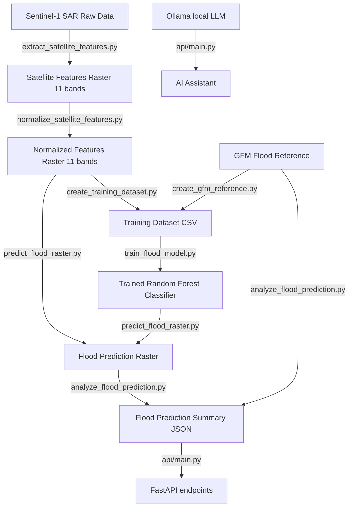

# Copernicus India Flood: Phase 1 — Existing Project Audit

## 1. Existing Architecture

The current project is structured as a Python-based machine learning pipeline with a FastAPI backend. It processes SAR (Synthetic Aperture Radar) satellite imagery to perform flood detection.



### Key Architectural Findings:
*   **No Database:** The current system operates entirely on local files (TIF, CSV, JSON, NetCDF). There is no active database (SQLite, PostgreSQL, or PostGIS). Wards and municipality risk information are not queried dynamically.
*   **Static API:** The FastAPI backend (`api/main.py`) reads statically pre-computed flood results from `data/processed/flood_prediction_summary.json` and `flood_prediction.tif`.
*   **AI Integration:** The backend integrates with Ollama's `qwen2.5:7b` model locally via HTTP requests, with a deterministic text-based fallback when Ollama is offline.
*   **No Frontend/Mobile Code:** There is currently no Flutter code, mobile project directory, or dashboard UI in the repository.
*   **Offline Support:** While the backend uses a local Ollama model, there is no offline sync logic or client side caching mechanism configured since the frontend does not exist yet.

---

## 2. Existing Datasets

The repository contains several key spatial and non-spatial datasets:

| Dataset Name | File Path / Location | Size | Details / Format |
| :--- | :--- | :--- | :--- |
| **IMD Rainfall** | `data/raw/rainfall/RF25_ind2018_rfp25.nc` to `RF25_ind2025_rfp25.nc` | ~25.5 MB each | Daily gridded NetCDF rainfall data for India from 2018 to 2025. |
| **River Network** | `data/raw/hydrology/rivers/india_river_network.geojson` | - | India-wide river vector line layer (Layer 1). |
| **River Basins** | `data/raw/hydrology/river_basins/india_river_basins.zip` | - | River basins boundaries ZIP containing Shapefile/GeoJSON (Layer 2). |
| **Reservoirs & Dams**| `data/raw/hydrology/reservoirs/india_reservoirs_source.geojson` | - | 6,152 reservoir/dam polygons with attribute fields (Layer 3). |
| **Surface Waterbodies**| `data/raw/hydrology/water_bodies/india/india_surface_waterbodies.geojson` | **5.07 GB** | Massive, merged vector polygons of lakes and surface water bodies (Layer 4). |
| **Drainage & Canals**| `data/raw/hydrology/drainage/india_canal_network.geojson` | - | Vector canal network lines (Layer 5). |
| **Digital Elevation Model**| `data/processed/dem/dem_test_processed.tif` | 332 KB | Processed elevation raster (Float32, EPSG:4326). |
| **AOI Before Imagery**| `flood_aoi/before_vv_vh.tiff` | 1.91 MB | Pre-flood Sentinel-1 SAR scene (August 20, 2024, 512x512, EPSG:4326, VV/VH bands). |
| **AOI After Imagery** | `flood_aoi/after_vv_vh.tiff` | 1.92 MB | Post-flood Sentinel-1 SAR scene (September 1, 2024, 512x512, EPSG:4326, VV/VH bands). |
| **GFM Reference** | `data/processed/gfm_flood_reference.tif` | 2.43 KB | Ground truth flood extent from Copernicus Global Flood Monitoring reprojected to target grid. |
| **ML Training Data** | `data/processed/flood_training_dataset.csv` | 32.5 MB | Pixel-wise tabular dataset mapping Sentinel-1 features to GFM flood labels. |

---

## 3. Existing ML Pipeline

The machine learning pipeline implements a supervised pixel-based classification model.

```
SAR Raw Geotiffs (Before/After) 
  ↓ (extract_satellite_features.py)
11 raw backscatter & ratio bands 
  ↓ (normalize_satellite_features.py)
Percentile clipping (1st - 99th) and Min-Max scaling
  ↓ (create_training_dataset.py)
 Tabular CSV mapping valid pixels to GFM labels (0/1)
  ↓ (train_flood_model.py)
Trained Random Forest Classifier (saved as .joblib)
  ↓ (predict_flood_raster.py)
Classified Binary Flood Raster (0 = Non-Flood, 1 = Flood)
```

### Verification of the ML Pipeline:
We verified that the full data extraction, preprocessing, model loading, prediction, and validation cycle executes cleanly without any errors:
1. Running `verify_normalized_features.py` succeeded with status code 0, confirming that the 11 feature bands are correctly scaled to `[0.0, 1.0]` and contain no non-finite values.
2. Running `predict_flood_raster.py` loaded `flood_random_forest_model.joblib` and successfully generated the classification map `flood_prediction.tif`.
3. Running `analyze_flood_prediction.py` evaluated the raster against the GFM Ground Truth, reporting:
   *   **Total study area:** 118.94 km²
   *   **Estimated flooded area:** 3.26 km² (2.74% of the pixels)
   *   **Intersection-over-Union (IoU):** 63.25%
   *   **Dice Coefficient:** 77.49%
   *   **Risk Classification:** `MODERATE`

---

## 4. Existing Model and Feature Parameters

### Random Forest Configuration:
*   **Estimator:** `RandomForestClassifier(n_estimators=300, min_samples_leaf=2, class_weight='balanced', random_state=42, n_jobs=-1)`
*   **Target Variable:** `flood_label` (0 = Non-Flood, 1 = Flood).
*   **Preprocessing:** Min-Max scaling after clipping out the bottom 1% and top 1% percentiles to remove backscatter extremes.
*   **Stratification:** 80/20 train/test split, stratified to preserve class balance.
*   **Imbalance Handling:** Balanced class weights assigned automatically by the classifier.

### The 11 Input Features:
The model utilizes dual-polarization Sentinel-1 (VV + VH) backscatter values and their mathematical changes:
1.  `before_vv`: Pre-flood VV polarization backscatter coefficient.
2.  `before_vh`: Pre-flood VH polarization backscatter coefficient.
3.  `after_vv`: Post-flood VV polarization backscatter coefficient.
4.  `after_vh`: Post-flood VH polarization backscatter coefficient.
5.  `vv_change`: $after\_vv - before\_vv$
6.  `vh_change`: $after\_vh - before\_vh$
7.  `vv_ratio`: $after\_vv / (before\_vv + \epsilon)$
8.  `vh_ratio`: $after\_vh / (before\_vh + \epsilon)$
9.  `before_vv_vh_ratio`: $before\_vv / (before\_vh + \epsilon)$
10. `after_vv_vh_ratio`: $after\_vv / (after\_vh + \epsilon)$
11. `vv_vh_change`: $after\_vv\_vh\_ratio - before\_vv\_vh\_ratio$

---

## 5. Summary of Preprocessing and Scripts

*   `extract_satellite_features.py`: Computes absolute change and ratios using a small offset ($\epsilon = 10^{-6}$) to avoid division-by-zero errors.
*   `normalize_satellite_features.py`: Performs percentile-based outlier clipping (1st and 99th percentiles) per feature band and scales variables to $[0.0, 1.0]$.
*   `create_training_dataset.py`: Filters out pixels that are out of bounds, contain non-finite numbers, or have invalid GFM labels ($255 = nodata$). Saves valid pixel values into `flood_training_dataset.csv`.
*   `train_flood_model.py`: Performs model fitting, classification evaluation (PR-AUC, ROC-AUC, Precision, Recall, F1), prints feature importance, and serializes the model to `.joblib`.
*   `predict_flood_raster.py`: Flattens the normalized features raster, performs prediction, and reconstructs the classified 1-band GeoTIFF.
*   `analyze_flood_prediction.py`: Translates pixel statistics into physical area measurements using latitude-dependent geodesic approximation, and compares findings to the GFM reference.

---

## 6. Missing Components and Problems Discovered

> [!WARNING]
> **No Dynamic Risk Modeling or Forecasting:** The ML model is purely an *observational* classifier. It identifies water on the ground using radar difference images. It does not ingest the gridded rainfall dataset (`.nc` files) or elevation datasets to *predict future* or *forecast* risk levels before a flood event occurs.
>
> **No Administrative Boundaries:** The system currently has no geospatial files (e.g. GeoJSON/Shapefiles) defining the administrative boundaries of states, districts, municipalities, or wards in India. There is no mapping from pixel coordinates to administrative zones.
>
> **Large File Overhead:** The merged surface waterbody file `india_surface_waterbodies.geojson` is **5.07 GB**. This file is too large to load into memory or bundle in applications. It must be indexed spatially using a local or remote SQL database (SpatiaLite / PostGIS) or partitioned into smaller regional boundary files.
>
> **No Database Backend:** The current backend API has no database integration. It serves static values from disk and cannot handle citizen accounts, synchronization metadata, weather history, or dynamic alerts.
>
> **No Mobile / Frontend Codebase:** No Flutter workspace exists. A complete mobile app must be built from scratch.

---

## 7. Recommended Next Steps

1.  **Introduce an Offline-First Database:** Create a lightweight database structure (SQLite/SpatiaLite locally, preparing for PostgreSQL/PostGIS in production) to query and store:
    *   Rainfall records (IMD daily grid data)
    *   Wards, municipalities, and districts boundaries
    *   Risk assessment profiles (Observed and Forecasted risk)
2.  **Spatially Slice Waterbody Vector Data:** Index the massive waterbodies file and slice it dynamically per district or municipality boundary to prevent performance bottlenecks.
3.  **Process Rainfall NetCDF Data:** Write a preprocessing utility to ingest gridded NetCDF files, extract rainfall accumulation metrics, and associate them with administrative districts/wards.
4.  **Integrate Static/Forecast Features into Risk Model:** Upgrade the predictive capability by combining:
    *   Current elevation (from DEM)
    *   Proximity to water bodies (rivers/reservoirs)
    *   Rainfall forecast/observed records
    to assign LOW, MODERATE, HIGH, and SEVERE risk levels per ward.
5.  **Create the FastAPI Database Layer:** Implement Pydantic schema validation and SQLAlchemy models in the backend.
6.  **Scaffold the Flutter Mobile App:** Initiate an offline-first Flutter project with cross-platform map layers (vector tiles or cached map caches), multilingual interface elements, and client-side database caching.
